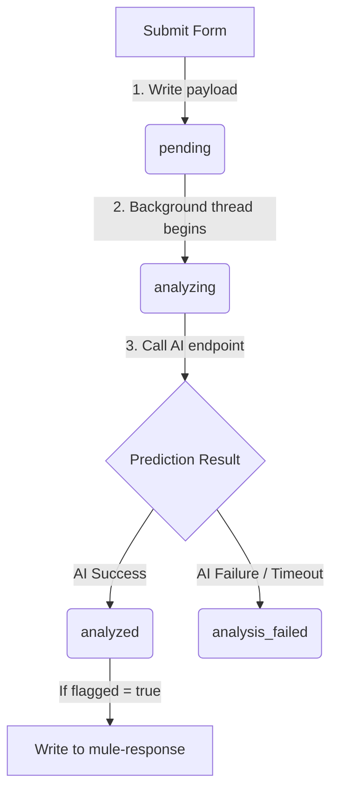

# Bank of India — FraudWatch AI Database Documentation

This document outlines the architecture, schemas, and state machine lifecycle for the Firebase Realtime Database used in the **FraudWatch AI** banking security application.

---

## 1. Database Overview

* **Database Type:** Firebase Realtime Database (RTD)
* **Instance URL:** `https://muletrace-7993b-default-rtdb.firebaseio.com`
* **Root Nodes:**
  * `/transactions`: Contains the master record of all transactions, background AI results, and flagged mule responses.
  * `/accounts`: Houses account-centric transaction directories for fast querying of sent/received payments.
  * `/MuleTrace`: Project meta flag/configuration parameters.

---

## 2. Master Transactions Schema (`/transactions`)

The `/transactions` path stores all individual transactions under push IDs generated by the Firebase SDK.

### Path: `/transactions/{txnId}`

Each transaction node contains basic transfer details, input feature lists sent to the machine learning model, and prediction metadata.

```json
{
  "accountFrom": "ACC001",
  "accountTo": "ACC002",
  "amount": 25000000,
  "status": "analyzed",
  "mule": true,
  "risk_tier": "CRITICAL",
  "mule_probability": 1.0,
  "signals_triggered": 6,
  "signals": [
    "Signal 6b: Student Account High Tx Count",
    "Signal 7: Multiple Linked Accounts",
    "Pass-Through Ratio Near 0.5 (Fund Circulation)"
  ],
  "timestamp": "2026-06-09T15:01:12.053Z",
  "ai_analyzed_at": "2026-06-09T15:01:21.569Z",
  "features": {
    "F3891": "student",
    "F3894": 18,
    "F3889": "L7D",
    "F3895": 350,
    "F3799": 25000000,
    "F3800": 24900000,
    "F3796": 650,
    "F3797": 12,
    "F3890": "M",
    "F3886": "Savings",
    "F3893": "RETAIL",
    "F3919": 6,
    "F3887": 1,
    "F3920": 4,
    "F3905": 1.0,
    "F3915": 1.0,
    "F3922": 3
  }
}
```

### Property Definitions

| Property | Type | Description |
| :--- | :--- | :--- |
| `accountFrom` | `String` | Sender account number/ID. |
| `accountTo` | `String` | Receiver account number/ID. |
| `amount` | `Number` | Transaction amount in standard currency subunits. |
| `status` | `String` | Current processing state (`pending`, `analyzing`, `analyzed`, or `analysis_failed`). |
| `mule` | `Boolean` | Flag showing if the transaction is verified/flagged as a mule. |
| `risk_tier` | `String` | Risk level assigned by AI model (`PENDING`, `LOW`, `MEDIUM`, `HIGH`, `CRITICAL`). |
| `mule_probability` | `Double` | Confidence interval of the mule classification (scale: `0.0` to `1.0`). |
| `signals_triggered`| `Integer` | Count of alert indicators flagged by the model. |
| `signals` | `List<String>` | Human-readable descriptions of triggered anomalies. |
| `timestamp` | `String` | ISO 8601 creation timestamp. |
| `ai_analyzed_at` | `String` | ISO 8601 timestamp representing completion of AI analysis. |
| `features` | `Map` | Key-value set containing the 17 behavioral metrics processed by the model. |

---

## 3. Flagged Audit Log Schema (`/transactions/mule-response`)

When the AI model determines a transaction is a mule (`mule: true`), the complete raw model evaluation is logged to `/transactions/mule-response` for security investigation and forensic reporting.

### Path: `/transactions/mule-response/{txnId}`

```json
{
  "txnId": "-OufiADYz2_5gxpHGBzq",
  "accountFrom": "ACC001",
  "accountTo": "ACC002",
  "amount": 25000000,
  "mule_probability": 1.0,
  "risk_tier": "CRITICAL",
  "flagged": true,
  "signals": [
    "Signal 6b: Student Account High Tx Count",
    "Signal 7: Multiple Linked Accounts"
  ],
  "proofs": [],
  "signals_triggered": 2,
  "analyzed_at": "2026-06-09T15:01:21.569Z"
}
```

---

## 4. Accounts Directory Schema (`/accounts`)

To prevent searching through millions of global transactions when loading individual bank statements, references are stored under `/accounts` for both sender and receiver.

### Path: `/accounts/{accountId}/sent/{txnId}`

Tracks outbound transfers from an account.

```json
{
  "to": "ACC002",
  "amount": 25000000,
  "timestamp": "2026-06-09T15:01:12.053Z",
  "txnId": "-OufiADYz2_5gxpHGBzq"
}
```

### Path: `/accounts/{accountId}/received/{txnId}`

Tracks inbound transfers to an account.

```json
{
  "from": "ACC001",
  "amount": 25000000,
  "timestamp": "2026-06-09T15:01:12.053Z",
  "txnId": "-OufiADYz2_5gxpHGBzq"
}
```

---

## 5. State Machine Lifecycle

Transactions progress through a non-blocking asynchronous pipeline, updating states in Firebase in the following sequence:



### State States Description
1. **`pending`**: Pushed immediately. This signifies the transaction has been recorded, but the model has not evaluated it.
2. **`analyzing`**: Updated right before calling the AI endpoint. This locks the transaction so it isn't picked up or processed twice.
3. **`analyzed`**: The prediction API responded successfully. The transaction is updated with predictions, probability, and risk tiers.
4. **`analysis_failed`**: The prediction API failed (e.g. server timeout/cold-start). The system updates to failure so it does not remain stuck.

---

## 6. AI Feature Reference (17 Input Parameters)

Below is a reference guide to the feature identifiers (keys) mapped within the `features` node:

| Key | Label | Description / Sample Range |
| :--- | :--- | :--- |
| **F3891** | Occupation | Occupational profile of customer (`student`, `salaried`, `housewife`, `others`). |
| **F3894** | Age | Customer's age (e.g., `18`). |
| **F3889** | Account Tenure Code | String representing how long the account has been active (e.g., `L7D`). |
| **F3895** | Credit Score | Bank credit rating (range: `300` - `900`). |
| **F3799** | Total Inward Amount | Lifetime credit volume. |
| **F3800** | Total Outward Amount | Lifetime debit volume. |
| **F3796** | Credit Tx Count | Total number of deposits/credits (e.g., `650`). |
| **F3797** | Debit Tx Count | Total number of withdrawals/debits (e.g., `12`). |
| **F3890** | Location Segment | Urbanicity code (`U` = Urban, `M` = Semi-Urban, `R` = Rural). |
| **F3886** | Account Type | Account class (`Savings` or `Current`). |
| **F3893** | Customer Segment | Retail banking indicator (`RETAIL` or `SME`). |
| **F3919** | Credit Tx Rate | Rate of deposit velocity. |
| **F3887** | Avg Debit Tx Amount | Normalized average size of debit transactions. |
| **F3920** | Avg Tx Amount | Normalized transaction sizing. |
| **F3905** | Normalised Credit Score | Rescaled value (range: `0.0` to `1.0`). |
| **F3915** | Net Flow Efficiency | Flow ratio of funds entering vs leaving (range: `-1.0` to `+1.0`). |
| **F3922** | Account Type Code | Integer type classification. |

---

## 7. Recommended Firebase Security Rules

To secure transactions against unauthorized tampering, apply the following rules structure to your Firebase Console:

```json
{
  "rules": {
    "transactions": {
      ".read": "auth != null",
      "$txnId": {
        ".write": "auth != null",
        ".validate": "newData.hasChildren(['accountFrom', 'accountTo', 'amount', 'status'])"
      },
      "mule-response": {
        ".read": "auth != null",
        "$txnId": {
          ".write": "auth != null && newData.child('flagged').val() == true"
        }
      }
    },
    "accounts": {
      "$accountId": {
        ".read": "auth != null",
        "sent": {
          "$txnId": {
            ".write": "auth != null"
          }
        },
        "received": {
          "$txnId": {
            ".write": "auth != null"
          }
        }
      }
    }
  }
}
```
